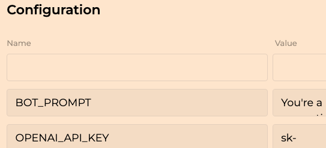
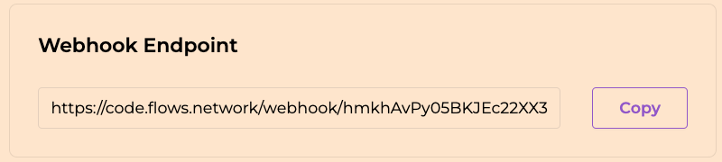

# OpenAI Q&A Pair Generator

Deploy this function on your server, and you will get a service that uses OpenAI's GPT models to generate question and answer pairs from text provided via HTTP POST requests.

Try it out by deploying your own instance and sending text to see the generated Q&A pairs!

This function uses async_openai_wasi to access JSON mode - one of OpenAI's latest advancement in gpt models. 

## Prerequisites

* You will need to bring your own [OpenAI API key](https://openai.com/blog/openai-api). If you do not already have one, [sign up here](https://platform.openai.com/signup).

* Set your OPENAI_API_KEY, and BOT_PROMPT environment variable as indicated in the screenshot:
  


You'll get a unique url after your flows function has been successfully built, now you can use it as api endpoint to communicate with your function.



## Give it a try

Send a POST request with text to your serverless function:

```bash
curl -X POST https://code.flows.network/webhook/hmkhAvPy05BKJEc22XX3 \
-H "Content-Type: text/plain" \
-d "Your text here"
```

You'll receive a CSV response with Q&A pairs derived from the text you submitted.
``